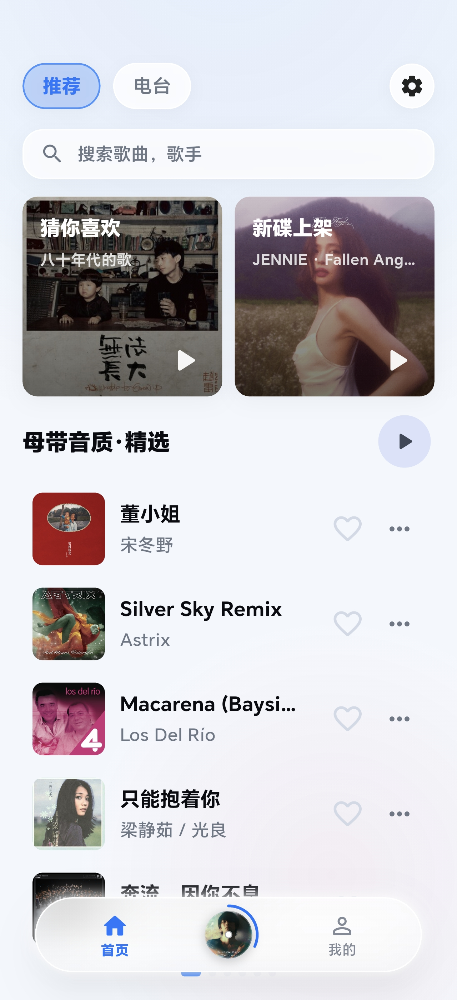
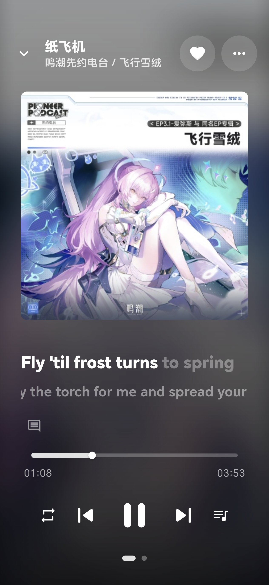
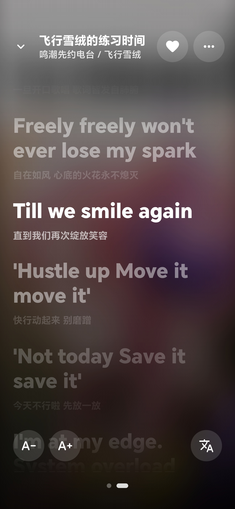
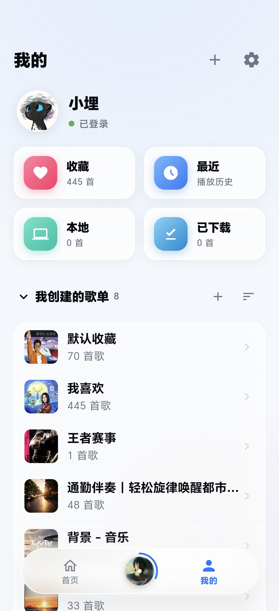
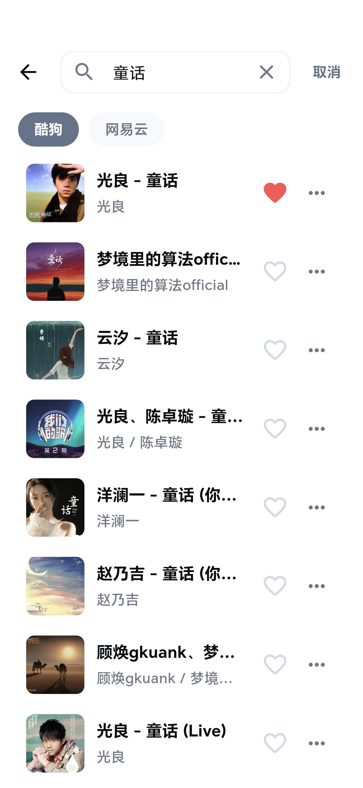
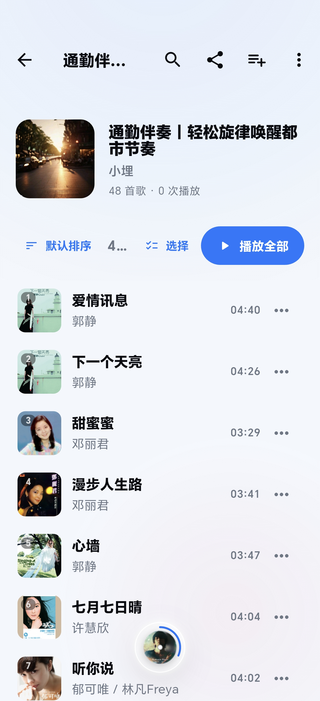

<p align="center">
  
</p>

<h1 align="center">REIKO（KA Music）</h1>

<p align="center">
  <strong>一个精致的第三方音乐客户端</strong>
  <br />
  基于 Flutter 构建 · 支持多平台 · Material You 设计 · 液态玻璃 UI
</p>

<p align="center">
  
  
  
  
</p>

<p align="center">
  
  
  
  
  
  
</p>

---

## 📖 简介

REIKO 是一个功能丰富的 **第三方音乐播放器**，使用 Flutter 框架构建，支持 Android、iOS、Windows、macOS、Linux 及 Web 六大平台。它提供跨平台音乐搜索、在线播放、逐字歌词、下载缓存等完整的音乐体验，采用 Material You 设计语言与 iOS 26 液态玻璃（Liquid Glass）视觉风格，支持深色模式和高度自定义主题。

> 🔌 该项目通过第三方 API 获取音乐数据（酷狗 + 网易云双音源），仅供学习交流使用。

应用通过 **Cloudflare R2** 自动分发更新：每次推送代码自动构建签名 APK、递增版本号并发布到 R2，应用内检查更新直接读取 R2 上的更新清单。

---

## 📸 预览

## 功能截图

| 首页推荐 | 播放器 | 歌词 |
|:-------:|:------:|:----:|
|  |  |  |

| 个人库 | 搜索页 | 歌单详情 |
|:------:|:------:|:--------:|
|  |  |  |

---

## ✨ 核心功能

### 🎵 音乐播放

- **多音源** — 酷狗 + 网易云双源搜索与播放，支持本地音乐、云盘歌曲
- **多音质切换** — 标准 (128K) / 高品质 (320K) / 无损 (FLAC) 三种音质
- **智能降级** — 播放失败时自动降级到更低音质重试，保证播放连续性
- **后台播放** — 支持 Android 通知栏控制及锁屏播放
- **播放模式** — 列表循环 / 随机播放 / 单曲循环
- **倍速播放** — 支持 0.5x ~ 3.0x 变速播放
- **音频均衡器** — 10 段 EQ + 14 种预设音效（流行、摇滚、人声、低音、古典、电子、爵士、舞曲、嘻哈、民谣、乡村、3D 环绕、蝰蛇音效等）
- **低音增强** — 0~100% 强度可调
- **音量均衡** — 基于 Android 原生 DynamicsProcessing 的实时响度平衡
- **高潮试听** — 一键播放歌曲高潮片段，进度条标记高潮时间点
- **定时停止** — 支持按时间或当前歌曲播放完毕后自动停止

### 🎤 歌词

- **逐字歌词** — 支持 KRC 格式的逐字高亮歌词
- **歌词翻译** — 支持翻译和罗马音显示
- **桌面歌词** — Android 悬浮窗歌词（原生 LyricsOverlayService，逐字卡拉OK）
- **系统级歌词** — 通过 SuperLyric 将逐字时间轴发布到系统服务（Xposed 模块等可接收）
- **车载歌词** — 模拟主流音乐 App 广播，向车机中控推送歌词；自动检测 Android Automotive 车机并启用车机模式
- **歌词交互** — 双击跳转进度 / 长按复制 / 字体大小可调 / 非高亮行高斯模糊

### 🔍 搜索与发现

- **多平台搜索** — 酷狗 + 网易云音乐双源，支持单曲 / 专辑分类搜索
- **搜索建议** — 实时搜索联想
- **热搜关键词** — 分类展示热门搜索
- **搜索历史** — 本地保存，支持标签式快捷搜索
- **每日推荐** — 个性化歌曲推荐
- **推荐歌单** — 热门歌单浏览
- **FM 电台** — 红心 Radio 私人 FM + 分类电台
- **新歌速递 / 新碟上架 / 专辑商店**

### 📚 音乐库管理

- **歌单管理** — 创建 / 收藏 / 重命名 / 排序 / 批量删除
- **歌单分享** — 一键复制歌单歌曲列表到剪贴板
- **歌单导入** — 通过 ID 或网易云 / QQ 音乐分享链接导入他人歌单
- **歌单内搜索** — 快速查找歌单中的歌曲
- **收藏歌曲** — 我喜欢 / 收藏管理
- **云盘** — 个人云盘音乐存储
- **本地音乐** — MediaStore 扫描 + 拼音排序 + 扫描目录排除
- **播放历史与统计** — 最近播放、累计时长、最常听歌手 / 歌曲 Top 10

### 📥 下载与缓存

- **下载管理** — 支持并发下载、断点续传、进度追踪、批量下载
- **播放缓存** — 自动缓存播放过的歌曲，LRU 策略，上限可调
- **数据缓存** — SWR（Stale-While-Revalidate）策略，分级 TTL
- **缓存可视化** — 数据缓存 / 下载 / 播放缓存大小查看与清理

### 🎨 个性化

- **液态玻璃 UI** — iOS 26 Liquid Glass 视觉风格，悬浮玻璃底栏与黑胶唱片动效
- **Material You** — 支持 Dynamic Color，8 种预设种子色
- **深色模式** — 跟随系统或手动切换
- **自定义背景** — 支持从相册选取图片作为全局背景，可调透明度
- **自定义 API** — 支持配置自定义 API 地址
- **全局字体缩放** — 标准 / 大 / 特大
- **桌面端快捷键** — 空格播放/暂停，左右方向键切歌

### 🎮 更多

- **音乐游戏** — 内置赛博朋克风节奏游戏（实时 FFT 频谱驱动、Fever 暴走、长键判定，实验性功能）
- **VIP 福利** — 我的 VIP 页面展示会员状态，自动领取每日 VIP 福利

---

## 🏗️ 技术栈

| 类别 | 技术 |
|---|---|
| **框架** | Flutter (SDK ^3.11.5) |
| **语言** | Dart |
| **音频播放** | `just_audio` — 低延迟音频引擎 |
| **后台播放** | `audio_service` — 通知栏控制 & 后台保活 |
| **音频焦点** | `audio_session` — 系统级音频焦点管理 |
| **HTTP** | `http` (API 请求) + `dio` (文件下载) |
| **持久化** | `shared_preferences` — 设置 & 缓存 |
| **状态管理** | `ChangeNotifier` + `AnimatedBuilder`（原生方案） |
| **原生能力** | MethodChannel — 均衡器 / 桌面歌词 / SuperLyric / 车机检测 / 本地扫描 |
| **设计系统** | Material 3 (Material You) + 液态玻璃组件 |
| **分发** | GitHub Actions + Cloudflare R2 |
| **代码规范** | `flutter_lints` |

---

## 📐 架构设计

```
┌─────────────────────────────────────┐
│              UI Layer               │
│   Pages · Widgets · AppTheme        │
├─────────────────────────────────────┤
│           Controllers               │
│   Auth · Player · Download · Theme  │  ← ChangeNotifier
├─────────────────────────────────────┤
│            Services                 │
│   MusicApi · CacheService           │
│   DownloadService · AudioHandler    │
│   桌面歌词 · SuperLyric · 车机歌词    │
├─────────────────────────────────────┤
│              Core                   │
│   ApiClient (HTTP + 重试 + Session) │
├─────────────────────────────────────┤
│             Config                  │
│   AppConfig · Models                │
└─────────────────────────────────────┘
```

- **分层清晰** — UI → Controller → Service → Core，单向依赖
- **手动 DI** — 构造函数注入，无第三方 DI 框架
- **SWR 缓存** — 先返回缓存数据，后台刷新，失败回退缓存
- **自动重试** — 网络请求指数退避重试（2 次，500ms/1s）
- **Session 管理** — `X-Kg-Session-Id` 持久化，自动恢复登录

---

## 📦 下载与更新

### 用户下载

最新版本始终可从以下地址获取：

- 更新清单：<https://dl.suen.us.ci/latest.json>
- 安装包：<https://dl.suen.us.ci/releases/>（保留最新 2 个版本）

应用内 **设置 → 关于 → 检查更新** 可直接升级，更新说明随版本自动展示；更新说明中包含 `[force]` 标记时视为强制更新。

### 版本号规则

| 字段 | 规则 | 示例 |
|---|---|---|
| 版本号 versionName | pubspec 的 `主.次` + CI run_number 作为修订号 | `3.1.15` |
| 版本码 versionCode | `1000000 + run_number`，严格单调递增 | `1000015` |

每次推送 master/main 自动构建并递增版本，无需手动维护版本号。

---

## 🚀 快速开始

### 环境要求

- Flutter SDK >= 3.11.5
- Dart SDK >= 3.11.5
- Android Studio / VS Code
- 目标平台对应的 SDK

### 安装与运行

```bash
# 克隆仓库
git clone https://github.com/suanx/relko-music.git
cd relko-music

# 安装依赖
flutter pub get

# 运行（选择目标平台）
flutter run          # 自动检测设备
flutter run -d android
flutter run -d windows
flutter run -d macos
flutter run -d linux
flutter run -d chrome
```

### 编译环境变量

| 变量 | 说明 | 默认值 |
|---|---|---|
| `KA_MUSIC_API_BASE_URL` | 自定义默认 API 地址 | `https://music.api.hoilai.cn` |
| `KA_MUSIC_UPDATE_MANIFEST_URL` | 应用更新清单（latest.json）地址 | `https://dl.suen.us.ci/latest.json` |
| `KA_MUSIC_DEBUG_LYRICS` | 启用歌词调试日志 | `true` |

```bash
# 编译时指定环境变量示例
flutter run --dart-define=KA_MUSIC_API_BASE_URL=https://your-api.com
```

---

## ⚙️ CI/CD（GitHub Actions → Cloudflare R2）

推送 `master` / `main` 后自动执行：

1. **计算版本** — 版本号/版本码按上述规则自动递增，更新说明取自提交信息；
2. **构建签名 APK** — arm64 release，签名密钥随仓库提供；
3. **上传 R2** — APK 上传至 `releases/` 目录，同时生成 `latest.json` 更新清单；
4. **清理旧版本** — R2 仅保留最新 **2** 个安装包，其余自动删除；
5. **发布 GitHub Release** — 以版本号为 tag（如 `v3.1.16`）创建 Release，附上 APK 与更新说明，同时作为 R2 不可用时的备用更新源。

`latest.json` 结构：

```json
{
  "platform": "android",
  "versionName": "3.1.15",
  "versionCode": 1000015,
  "updateContent": "提交信息（应用内更新说明）",
  "downloadUrl": "https://dl.suen.us.ci/releases/REIKO-v3.1.15.apk",
  "forceUpdate": false,
  "releaseDate": "2026-09-29T09:46:21Z",
  "sha256": "…"
}
```

### 所需 GitHub Secrets

| Secret | 说明 |
|---|---|
| `R2_ACCOUNT_ID` | Cloudflare 账户 ID |
| `R2_ACCESS_KEY_ID` | R2 API 令牌 Access Key ID（Object Read & Write） |
| `R2_SECRET_ACCESS_KEY` | R2 API 令牌 Secret Access Key |
| `R2_BUCKET` | R2 桶名 |

> ⚠️ R2 令牌需注意：权限为「对象读和写」、建议应用于所有存储桶、不要配置 IP 过滤；若桶位于特定管辖权（如 US），必须使用对应的管辖权专属 S3 端点。

### 应用内检查更新逻辑

优先读取 R2 更新清单（`KA_MUSIC_UPDATE_MANIFEST_URL`），失败时自动回退 GitHub Releases；版本比较使用 versionCode 整数大小。

---

## 📁 项目结构

```
lib/
├── main.dart                 # 应用入口（依赖组装、播放状态恢复）
├── assets/
│   └── logo.png              # App Logo
├── config/
│   └── app_config.dart       # 全局配置（API 地址、更新清单、缓存大小等）
├── core/
│   ├── api_client.dart       # HTTP 客户端（重试、Session）
│   ├── folder_filter.dart    # 本地扫描目录过滤
│   └── pinyin_utils.dart     # 拼音排序
├── controllers/
│   ├── auth_controller.dart  # 登录认证 / 我喜欢
│   ├── player_controller.dart# 播放引擎 / 均衡器 / 歌词分发
│   ├── download_controller.dart # 下载与播放缓存
│   ├── local_music_controller.dart # 本地音乐
│   └── theme_controller.dart # 主题 / 车机模式
├── models/
│   ├── music_models.dart     # 音乐领域模型（Song / Playlist / 歌词等）
│   └── app_version.dart      # 版本更新模型
├── services/
│   ├── music_api.dart        # API 接口封装 + KRC/LRC 歌词解析
│   ├── cache_service.dart    # 数据缓存（SWR）
│   ├── download_service.dart # 文件下载服务
│   ├── music_audio_handler.dart # 后台音频服务
│   ├── app_update_service.dart  # 应用内检查更新（R2 清单优先）
│   ├── audio_effects_service.dart # 均衡器 / 低音增强 / 音量均衡
│   ├── desktop_lyrics_service.dart # 桌面悬浮歌词
│   ├── super_lyric_service.dart    # SuperLyric 系统级歌词
│   ├── bluetooth_lyrics_service.dart # 车载蓝牙歌词广播
│   ├── playback_history_service.dart / playback_stats_service.dart
│   └── vip_background_task.dart    # 每日 VIP 福利自动领取
└── ui/
    ├── app_theme.dart        # 主题定义
    ├── adaptive_layout.dart  # 响应式布局
    ├── widgets/liquid_glass_ui.dart # 液态玻璃组件
    ├── pages/                # 页面（首页 / 播放器 / 搜索 / 歌单 / 云盘…）
    │   └── rhythm_game/      # 节奏游戏（实验性）
    └── widgets/              # 可复用组件
```

---

## 📝 更新日志

详细的版本更新日志请查看 [update.md](update.md)。

---

## 📄 许可证

本项目仅供学习交流使用，请勿用于商业用途。

---

<p align="center">
  <sub>Made with XiaoMai and Flutter</sub>
</p>
